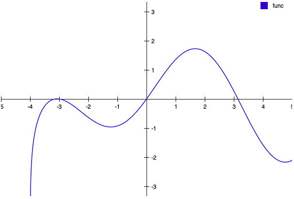

# Plotteroni

Welcome to Plotteroni, an easy to use JavaScript library that can plot functions inside your browser. Plotteroni aims to be inituitive as a pepperoni is spicy.

In this README, you will find information about the basic usage.

## Setup

Here you see the html file your plot will be shown in later. In the `<head>` tag we include Plotteroni and at the end of the `<body>` the script where we will create the actual plot.

```html
<!DOCTYPE html>
<html>
<head>
    <meta charset="utf-8" />
    <title>Plotteroni Example</title>
    <script src="https://cdn.jsdelivr.net/gh/codingbobby/plotteroni/pltrni.min.js"></script>
</head>
<body>
    <script src="plot.js"></script>
</body>
</html>
```

Now you can put your stuff into `plot.js`.

The first thing we want to do, is defining the options of our plot. Here we give the plot window a height of 400 and a width of 600 pixels. There are plenty more options available but these two are the minimum of requirement.

```js
const options = {
    height: 400,
    width: 600
}
```

Now we create a new `Plotteroni` instance which represents the plot and contains all the methods we can apply with the options we've set.

```js
const plot = new Plotteroni(options)
```

To add a function that we want to plot, we can simply define one as you know it from JavaScript. It must take one argument and return a mathematical function that will yield a `number` when inserting a value for `x`. This is just a simple one but you can make is as complex as you wish and even use your own dataset for calculation.

```js

const func = function(x) {
    return Math.log(x + 4) * Math.sin(x)
}
```

After defining all the functions to plot in one graph, we can add them to the `Plotteroni` instance we created before. If you have more than just one as in this example, you can parse all of them in as you would do it with arguments. Note that you must not put `()` or `(x)` after them, but just their names.

```js
plot.add(func)
```

If we have everything set up, we can now draw the plot to the html page.

```js
plot.draw()
```

When opening the html from above in your browser you should see this:

